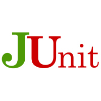
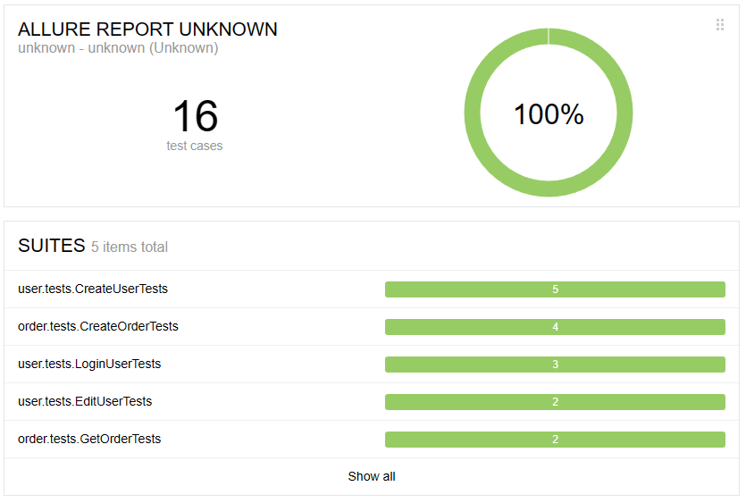
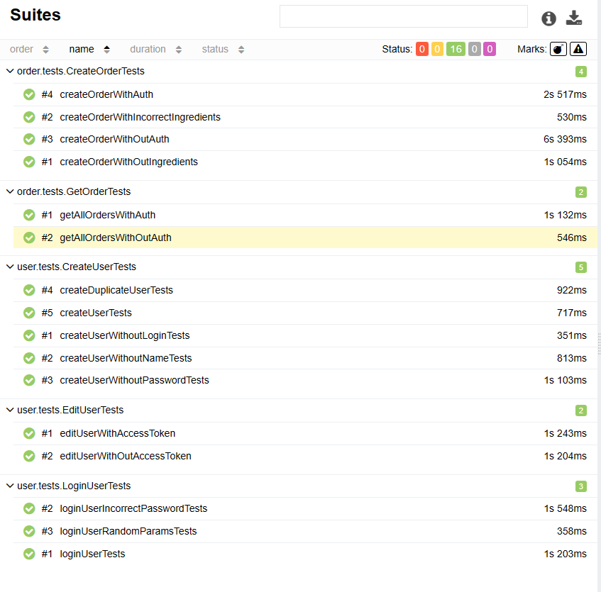

# Дипломный проект по автоматизации тестирования API для Stellarburgers. 
<a target="_blank" href="https://stellarburgers.nomoreparties.site/">Веб сайт Stellarburgers</a>


## :memo: Содержание:

- [Реализованные проверки](#boom-Реализованные-проверки)
- [Технологии](#classical_building-Технологии)
- [Запуск из терминала](#electron-Запуск-тестов-из-терминала)
- [Allure отчет](#bar_chart-Allure-отчет)

## :boom: Реализованные проверки

#### Создание пользователя
- ✓ Cоздать уникального пользователя
- ✓ Cоздать пользователя, который уже зарегистрирован
- ✓ Cоздать пользователя и не заполнить одно из обязательных полей

#### Логин пользователя
- ✓ Логин под существующим пользователем
- ✓ Логин с неверным логином и паролем

#### Изменение данных пользователя
- ✓ С авторизацией
- ✓ Без авторизации

#### Создание заказа
- ✓ С авторизацией
- ✓ Без авторизации
- ✓ С ингредиентами
- ✓ Без ингредиентов
- ✓ С неверным хешем ингредиентов

#### Получение заказов конкретного пользователя
- ✓ С авторизацией
- ✓ Без авторизации


## :classical_building: Технологии
<p align="center">




</p>


## :electron: Запуск тестов из терминала

```
mvn clean test
```

## :bar_chart: Allure-отчет
<p align="center">


  </p>

